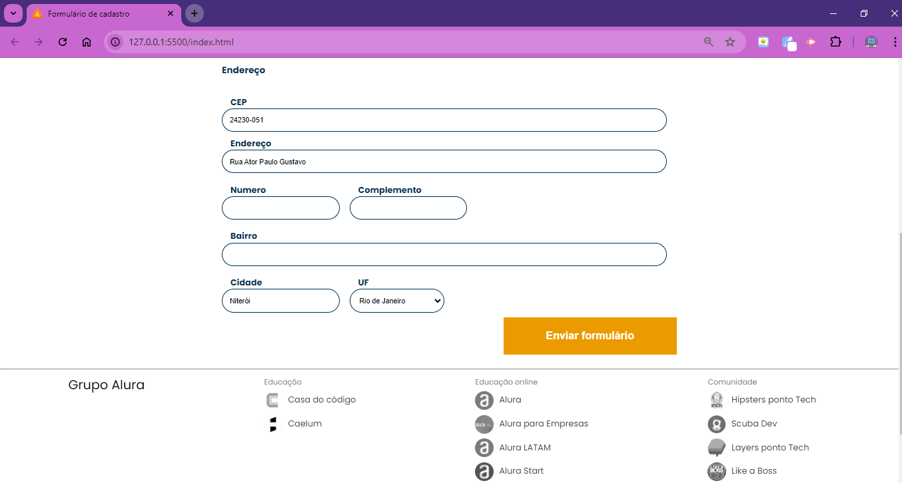

<h1> Alura Books - Formulário </h1>

Projeto realizado durante a Formação Front End T6 - ONE + Alura

JavaScript: consumindo e tratando dados de uma API

Nesse curso, foi abordado a manipulação de formulário para cadastro de clientes e utilizando a API do ViaCEP, foi implementado o preenchimento automático de endereço.

Deploy: https://joanatav.github.io/aluraBooks-formulario/ 

<h2>Preview 👀 </h2>

<h2>⚙️Tecnologias Utilizadas</h2>

